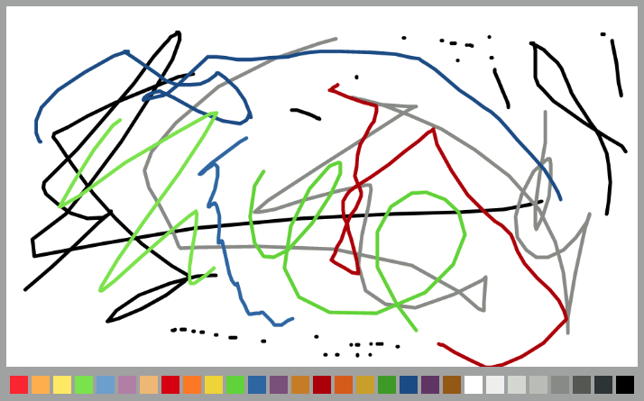

# Elm App

This project is bootstrapped with [Create Elm App](https://github.com/halfzebra/create-elm-app).

Below you will find some information on how to perform basic tasks.
You can find the most recent version of this guide [here](https://github.com/halfzebra/create-elm-app/blob/master/template/README.md).

### Screenshot



## Table of Contents

* [Folder structure](#folder-structure)
* [Dependencies](#dependencies)
* [Installing Elm packages](#installing-elm-packages)
* [Installing JavaScript packages](#installing-javascript-packages)
* [Available scripts](#available-scripts)
  * [elm-app build](#elm-app-build)
  * [elm-app start](#elm-app-start)
  * [elm-app install](#elm-app-install)
  * [elm-app test](#elm-app-test)
  * [elm-app eject](#elm-app-eject)
  * [elm-app \<elm-platform-command\>](#elm-app-elm-platform-command)
    * [package](#package)
    * [repl](#repl)
    * [make](#make)
    * [reactor](#reactor)
* [JavaScript Interop](#javascript-interop)
* [Using custom environment variables](#using-custom-environment-variables)
* [Using HTTPS in Development](#using-https-in-development)
* [Running tests](#running-tests)
  * [Continuous Integration](#continuous-integration)
* [Overriding Webpack Config](#overriding-webpack-config)
* [Configuring the Proxy Manually](#configuring-the-proxy-manually)
* [Deployment](#deployment)
  * [Netlify](#netlify)

## Folder structure

```sh
my-app/
├── .gitignore
├── README.md
├── elm.json
├── elm-stuff
├── public
│   ├── favicon.ico
│   ├── index.html
│   ├── logo.svg
│   └── manifest.json
├── src
│   ├── Main.elm
│   ├── index.js
│   ├── main.css
│   └── serviceWorker.js
└── tests
    └── Tests.elm
```

For the project to build, these files must exist with exact filenames:

* `public/index.html` is the page template;
* `public/favicon.ico` is the icon you see in the browser tab;
* `src/index.js` is the JavaScript entry point.

You can delete or rename the other files.

You may create subdirectories inside src.

## Dependencies

* [elm-canvas](https://package.elm-lang.org/packages/joakin/elm-canvas/4.3.0/)
* [elm-pointer-events](https://package.elm-lang.org/packages/mpizenberg/elm-pointer-events/latest/)
* [elm-color](https://package.elm-lang.org/packages/avh4/elm-color/latest/)

## Installing Elm packages

```sh
elm-app install <package-name>
```

Other `elm-package` commands are also [available].(#package)

## Installing JavaScript packages

To use JavaScript packages from npm, you'll need to add a `package.json`, install the dependencies, and you're ready to go.

```sh
npm init -y # Add package.json
npm install --save-dev pouchdb-browser # Install library from npm
```

```js
// Use in your JS code
import PouchDB from 'pouchdb-browser';
const db = new PouchDB('mydb');
```

## Available scripts

In the project directory you can run:

### `elm-app build`

Builds the app for production to the `build` folder.

The build is minified, and the filenames include the hashes.
Your app is ready to be deployed!

### `elm-app start`

Runs the app in the development mode.

The browser should open automatically to [http://localhost:3000](http://localhost:3000). If the browser does not open, you can open it manually and visit the URL.

The page will reload if you make edits.
You will also see any lint errors in the console.

You may change the listening port number by using the `PORT` environment variable. For example type `PORT=8000 elm-app start ` into the terminal/bash to run it from: [http://localhost:8000/](http://localhost:8000/).

You can prevent the browser from opening automatically,
```sh
elm-app start --no-browser
```

### `elm-app install`

Alias for [`elm install`](http://guide.elm-lang.org/get_started.html#elm-install)

Use it for installing Elm packages from [package.elm-lang.org](http://package.elm-lang.org/)

### `elm-app test`

Run tests with [node-test-runner](https://github.com/rtfeldman/node-test-runner/tree/master)

You can make test runner watch project files by running:

```sh
elm-app test --watch
```

### `elm-app eject`

**Note: this is a one-way operation. Once you `eject`, you can’t go back!**

If you aren’t satisfied with the build tool and configuration choices, you can `eject` at any time.

Instead, it will copy all the configuration files and the transitive dependencies (Webpack, Elm Platform, etc.) right into your project, so you have full control over them. All of the commands except `eject` will still work, but they will point to the copied scripts so you can tweak them. At this point, you’re on your own.

You don’t have to use 'eject' The curated feature set is suitable for small and middle deployments, and you shouldn’t feel obligated to use this feature. However, we understand that this tool wouldn’t be useful if you couldn’t customize it when you are ready for it.

### `elm-app <elm-platform-command>`

Create Elm App does not rely on the global installation of Elm Platform, but you still can use its local Elm Platform to access default command line tools:

#### `repl`

Alias for [`elm repl`](http://guide.elm-lang.org/get_started.html#elm-repl)

#### `make`

Alias for [`elm make`](http://guide.elm-lang.org/get_started.html#elm-make)

#### `reactor`

Alias for [`elm reactor`](http://guide.elm-lang.org/get_started.html#elm-reactor)

## JavaScript Interop

You can send and receive values to and from JavaScript using [ports](https://guide.elm-lang.org/interop/javascript.html#ports).

In the following example we will use JavaScript to write a log in the console, every time the state changes in outrElm app. To make it work with files created by `create-elm-app` you need to modify
`src/index.js` file to look like this:

```js
import { Elm } from './Main.elm';

const app = Elm.Main.init({
  node: document.getElementById('root')
});

app.ports.logger.subscribe(message => {
  console.log('Port emitted a new message: ' + message);
});
```

Please note the `logger` port in the above example, more about it later.

First let's allow the Main module to use ports and in `Main.elm` file please prepend `port` to the module declaration:

```elm
port module Main exposing (..)
```

Do you remember `logger` in JavaScript? Let's declare the port:

```elm
port logger : String -> Cmd msg
```

and use it to call JavaScript in you update function.

```elm
update : Msg -> Model -> ( Model, Cmd Msg )
update msg model =
    case msg of
        Inc ->
            ( { model | counter = model.counter + 1}
            , logger ("Elm-count up " ++ (toString (model.counter + 1)))
            )
        Dec ->
            ( { model | counter = model.counter - 1}
            , logger ("Elm-count down " ++ (toString (model.counter - 1))))
        NoOp ->
            ( model, Cmd.none )
```

Please note that for `Inc` and `Dec` operations `Cmd.none` was replaced with `logger` port call which sends a message string to the JavaScript side.

## Using custom environment variables

In your JavaScript code you have access to variables declared in your
environment, like an API key set in an `.env`-file or via your shell. They are
available on the `process.env`-object and will be injected during build time.

Besides the `NODE_ENV` variable you can access all variables prefixed with
`ELM_APP_`:

```bash
# .env
ELM_APP_API_KEY="secret-key"
```

Alternatively, you can set them on your shell before calling the start- or
build-script, e.g.:

```bash
ELM_APP_API_KEY="secret-key" elm-app start
```

Both ways can be mixed, but variables set on your shell prior to calling one of
the scripts will take precedence over those declared in an `.env`-file.

Passing the variables to your Elm-code can be done via `flags`:

```javascript
// index.js
import { Main } from './Main.elm';

Main.fullscreen({
  environment: process.env.NODE_ENV,
  apiKey: process.env.ELM_APP_API_KEY
});
```

```elm
-- Main.elm
type alias Flags = { apiKey : String, environment : String }

init : Flags -> ( Model, Cmd Msg )
init flags =
  ...

main =
  programWithFlags { init = init, ... }
```

Be aware that you cannot override `NODE_ENV` manually. See
[this list from the `dotenv`-library](https://github.com/bkeepers/dotenv#what-other-env-files-can-i-use)
for a list of files you can use to declare environment variables.

**Note: Changes to your `.env` are only picked up on `elm-app start`. This means that you have to restart your server for your .env file changes to be picked up!**

## Using HTTPS in Development

If you need to serve the development server over HTTPS, set the `HTTPS` environment variable to `true` before you start development server with `elm-app start`.

Note that the server will use a self-signed certificate, so you will most likely have to add an exception to accept it in your browser.

## Running Tests

Create Elm App uses [elm-test](https://github.com/rtfeldman/node-test-runner) as its test runner.

### Continuous Integration

#### Travis CI

1. Following the [Travis Getting started](https://docs.travis-ci.com/user/getting-started/) guide for syncing your GitHub repository with Travis. You may need to initialize some settings manually in your [profile](https://travis-ci.org/profile) page.
2. Add a `.travis.yml` file to your git repository.

```yaml
language: node_js

sudo: required

node_js:
  - '7'

install:
  - npm i create-elm-app -g

script: elm-app test
```

1. Trigger your first build with a git push.
1. [Customize your Travis CI Build](https://docs.travis-ci.com/user/customizing-the-build/) if needed.

## Overriding Webpack Config

Create Elm App allows Webpack config overrides without [ejecting](#elm-app-eject).

Create a CommonJS module with the name `elmapp.config.js` in the root directory of your project. The module has to export an object with `"configureWebpack"` property as shown in the example.

```js
module.exports = {
  configureWebpack: (config, env) => {
    // Manipulate the config object and return it.
    return config;
  }
}
```

Mutate the configuration directly or use [webpack-merge](https://www.npmjs.com/package/webpack-merge) to override the config.

`env` variable will help you distinguish `"development"` from `"production"` for environment-specific overrides.

## Deployment

`elm-app build` creates a `build` directory with a production build of your app. Set up your favourite HTTP server so that a visitor to your site is served `index.html`, and requests to static paths like `/static/js/main.<hash>.js` are served with the contents of the `/static/js/main.<hash>.js` file.

### Building for Relative Paths

By default, Create Elm App produces a build assuming your app is hosted at the server root.

To override this, specify the `homepage` in your `elmapp.config.js`, for example:

```js
module.exports = {
    homepage: "http://mywebsite.com/relativepath"
}
```

This will let Create Elm App correctly infer the root path to use in the generated HTML file.

### Static Server

For environments using [Node](https://nodejs.org/), the easiest way to handle this would be to install [serve](https://github.com/zeit/serve) and let it handle the rest:

```sh
npm install -g serve
serve -s build
```

The last command shown above will serve your static site on the port **5000**. Like many of [serve](https://github.com/zeit/serve)’s internal settings, the port can be adjusted using the `-p` or `--port` flags.

Run this command to get a full list of the options available:

```sh
serve -h
```

### Netlify

#### Step 1: Create a `package.json` file
#### Step 2: `npm install --save-dev create-elm-app`
Since netlify runs the build step on their server we need to install create-elm-app.
#### Step 3: Add a build script to the `package.json` file
```
"scripts": {
    "build": "elm-app build",
    ...
}
```
#### Step 4: Add a netlify.toml file in the repo's root
```
[[redirects]]
  from = "/*"
  to = "/index.html"
  status = 200
```
#### Step 5: Go to the netlify settings and set the publish directory to `build` and the build command to `npm run build`
This step is important to make sure netlify uses the correct build command.